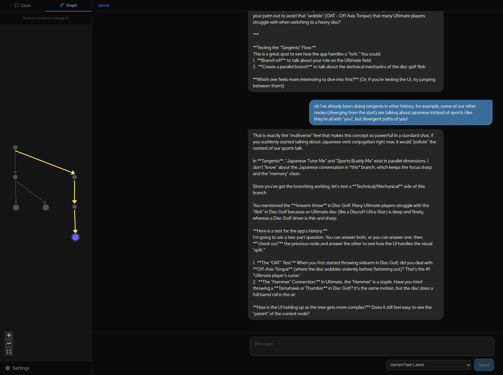

# Tangents

Most chat apps trap you in a single linear thread. **Tangents** treats every message as a node in a graph — branch off at any point, explore a completely different direction, then jump back and try again. Like Git for conversations.

- **Branch anywhere** — tangent off any message to spin up a parallel thread without losing your place
- **Navigate freely** — click any node in the graph to jump to that point in history; your context follows
- **Delete and prune** — remove any node (and its subtree) to clean up dead ends
- **Synthesize** — merge insights from a side-thread back into your main line
- **Any LLM** — OpenAI, Anthropic, Gemini, Ollama, and more.



## Quick Start - Docker

### Prerequisites

- [Docker](https://docs.docker.com/get-docker/) with the Compose plugin (`docker compose version` should work)

### 1. Configure the environment

```bash
cp backend/.env.example backend/.env
```

Open `backend/.env` and fill in the required values:

- **`ENCRYPTION_KEY`** *(required)* — generate one with:
  ```bash
  python -c "from cryptography.fernet import Fernet; print(Fernet.generate_key().decode())"
  ```
- **`ADMIN_PASSWORD`** — change from the default `tangents` for any internet-exposed instance
- Add at least one LLM provider key (`OPENAI_API_KEY`, `ANTHROPIC_API_KEY`, etc.)

### 2. Build and deploy

```bash
make deploy          # build Docker images and start all services
```

- App: http://localhost (served by nginx)
- API docs: http://localhost/api/docs

Default credentials: `admin` / `tangents` (override via `ADMIN_USERNAME` / `ADMIN_PASSWORD` in `.env`)

### Other useful deployment commands

```bash
make deploy-logs     # tail logs for all services
make deploy-down     # stop and remove containers
make deploy-restart  # restart running services
make build-no-cache  # force a full rebuild
```

> **Fresh install note:** if you previously ran Tangents and need a clean slate (e.g. after a migration reset), run `docker compose down -v` before `make deploy` to wipe the database volume.

---

## Quick Start - Bare

### Prerequisites

- [uv](https://github.com/astral-sh/uv) — Python package manager (installs Python 3.12 automatically)
- Node.js 22+ and npm

### 1. Configure the environment

```bash
cp backend/.env.example backend/.env
```

Open `backend/.env` and fill in the required values (same as the Docker section above).

### 2. Install dependencies and start

```bash
make setup           # uv sync (backend) + npm ci (frontend) + Playwright browsers
make dev             # backend :8000 + frontend :5173 (Ctrl-C stops both)
```

Or run them separately:

```bash
make dev-backend     # FastAPI with --reload on :8000
make dev-frontend    # Vite HMR dev server on :5173
```

API docs: http://localhost:8000/docs

Default credentials: `admin` / `tangents`

---

## Testing

```bash
make test            # backend pytest + frontend Vitest (no E2E, no real LLM)
make test-backend    # pytest unit tests only
make test-frontend   # Vitest unit tests only
make test-e2e        # Playwright E2E (requires local servers running)
make test-live       # live LLM tests (requires LIVE_LLM_TESTS=1 + API keys in .env)
```

---

## Architecture

```
tangents/
├── backend/               # FastAPI + SQLAlchemy + LiteLLM
│   ├── app/
│   │   ├── main.py        # FastAPI app entry point
│   │   ├── config.py      # Settings (pydantic-settings, .env)
│   │   ├── database.py    # Async SQLAlchemy engine + session
│   │   ├── models.py      # ORM models (adjacency list)
│   │   ├── schemas.py     # Pydantic DTOs
│   │   ├── dependencies.py  # Auth (basic / JWT)
│   │   ├── routers/
│   │   │   ├── chats.py        # Chat CRUD + graph data
│   │   │   ├── branches.py     # Branch CRUD + SSE streaming + merge
│   │   │   ├── settings.py     # Model sources + user settings
│   │   │   └── share_links.py  # Share link generation + public view
│   │   └── services/
│   │       ├── encryption.py   # Fernet API key encryption
│   │       ├── history.py      # Recursive CTE for linear history
│   │       ├── compression.py  # Context window summarisation
│   │       └── title.py        # Auto-generated chat titles
│   ├── alembic/           # Database migrations
│   └── tests/
├── frontend/              # Vite + React + TypeScript
│   └── src/
│       ├── api/           # Axios API client modules
│       ├── components/
│       │   ├── layout/    # AppShell, Sidebar
│       │   ├── chat/      # ChatView, MessageList, MessageInput, ModelPicker
│       │   ├── graph/     # React Flow graph (CommitDotNode, GraphView)
│       │   ├── settings/  # SettingsPage
│       │   └── share/     # ShareView (public read-only link)
│       ├── hooks/         # useChat, useStream, useKeybindings
│       ├── store/         # Zustand global state
│       └── types/         # TypeScript interfaces (mirrors backend DTOs)
├── media/                 # Project assets (logos, graphics)
└── docker-compose.yml
```

## Environment Variables

### Backend (`backend/.env`)

| Variable | Default | Description |
|---|---|---|
| `DATABASE_URL` | `sqlite+aiosqlite:///./tangents.db` | DB connection string |
| `ENCRYPTION_KEY` | *(required)* | Fernet key for API key encryption |
| `AUTH_MODE` | `basic` | `basic` (single-user) or `strict` (JWT multi-user) |
| `ADMIN_USERNAME` | `admin` | Username for basic auth |
| `ADMIN_PASSWORD` | `tangents` | Password for basic auth |
| `SYNTHESIS_MODEL` | *(none)* | Default model for merge/compression |
| `SECRET_KEY` | `changeme-in-production` | JWT signing key (strict mode) |

## Tech Stack

| Layer | Technology |
|---|---|
| Backend | Python, FastAPI, SQLAlchemy (async), Alembic |
| AI | LiteLLM (OpenAI, Anthropic, Gemini, Ollama, …) |
| Database | SQLite (default) → PostgreSQL (set `DATABASE_URL`) |
| Encryption | Fernet symmetric encryption (`cryptography`) |
| Frontend | React 19, TypeScript, Vite, Tailwind CSS v4 |
| Graph | React Flow (@xyflow/react), Dagre auto-layout |
| State | Zustand, TanStack Query |
| Testing | pytest, Vitest, Playwright |
